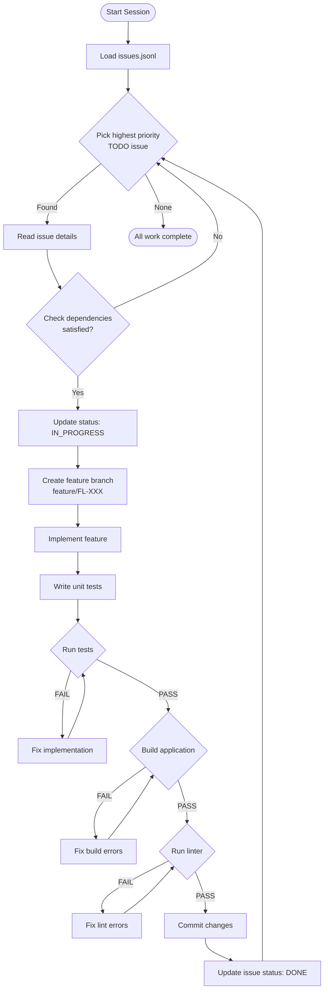

# ForgeLoop Agent Development Workflow

This document defines the **mandatory workflow** for any agent (human or AI) working on ForgeLoop.

## Core Principle
**Build → Test → Verify → Repeat**

Every feature must be tested before moving to the next. No exceptions.

---

## Development Flowchart



---

## Detailed Steps

### 1. Issue Selection
```
1. Read .beads/issues.jsonl
2. Filter: status === 'TODO'
3. Sort by: priority (CRITICAL > HIGH > MEDIUM > LOW)
4. For each candidate:
   - Check all dependencies are DONE
   - If satisfied, select this issue
5. Update issue status to IN_PROGRESS
```

### 2. Implementation Phase
```
1. Create branch: git checkout -b feature/FL-XXX
2. Read issue description carefully
3. Review acceptanceCriteria
4. Implement the feature step by step
5. Follow existing code patterns
```

### 3. Testing Phase (MANDATORY)
```
1. Write tests BEFORE marking complete
2. Test file location: __tests__/[module].test.ts
3. Run: npm test
4. ALL tests must pass
5. If tests fail, fix and re-run
```

### 4. Build Verification
```
1. Run: npm run build
2. Build must succeed with no errors
3. Fix any TypeScript errors
4. Fix any import issues
```

### 5. Completion
```
1. Commit with message: "feat(FL-XXX): [issue title]"
2. Update issue in issues.jsonl:
   - status: "DONE"
   - completedAt: ISO timestamp
3. Move to next issue
```

---

## Phase Order (MANDATORY)

Issues MUST be completed in phase order:

| Phase | Description | Prerequisites |
|-------|-------------|---------------|
| 1 | Skeleton | None |
| 2 | Thought Store | Phase 1 |
| 3 | Sandbox | Phase 1 |
| 4 | Perception | Phase 1, 3 |
| 5 | Reasoning | Phase 1 |
| 6 | Loop Integration | Phases 2-5 |
| 7 | PR Generation | Phase 6 |

---

## Issue Priority Legend

- **CRITICAL**: Blocks other work, must be done first
- **HIGH**: Important for core functionality
- **MEDIUM**: Enhances functionality
- **LOW**: Nice to have, can be deferred

---

## Commands Reference

```bash
# Start development
npm install

# Run tests
npm test

# Run specific test
npm test -- --grep "ThoughtStore"

# Build
npm run build

# Start dev server
npm run dev

# Lint
npm run lint
```

---

## Constraint Checklist

Before marking any issue DONE, verify:

- [ ] Feature implemented as described
- [ ] All acceptance criteria met
- [ ] Unit tests written and passing
- [ ] Build succeeds
- [ ] No TypeScript errors
- [ ] Imports are correct
- [ ] Code follows existing patterns
